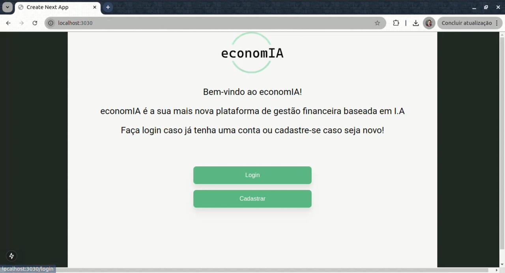
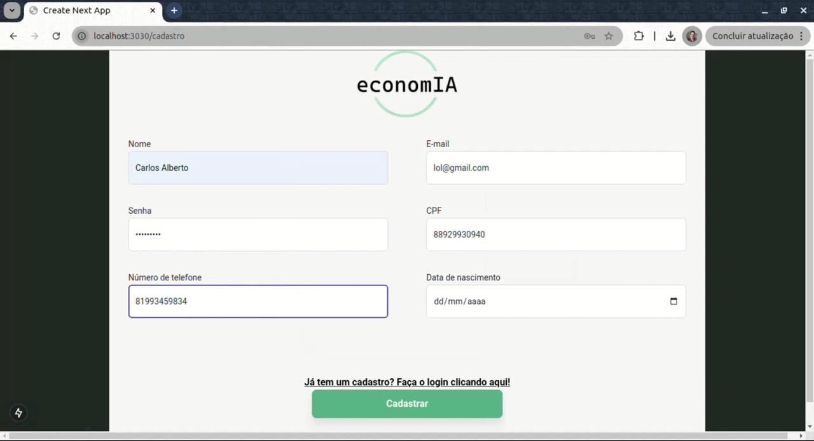
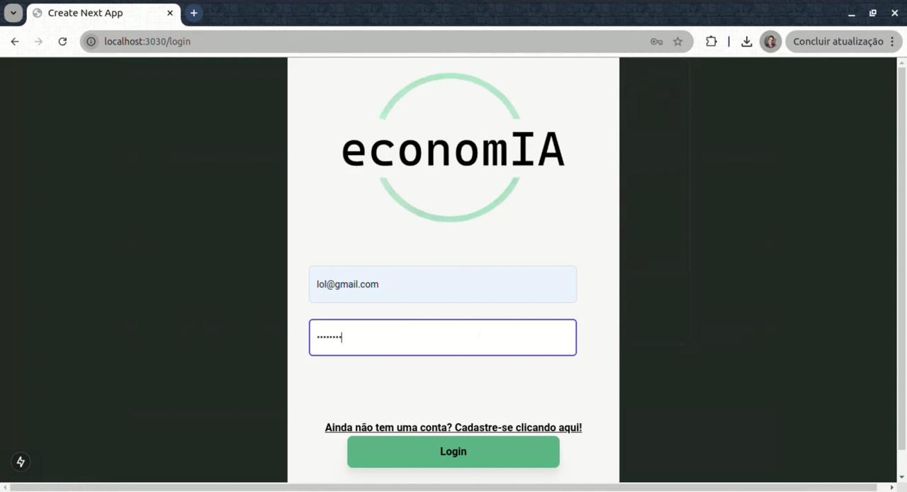
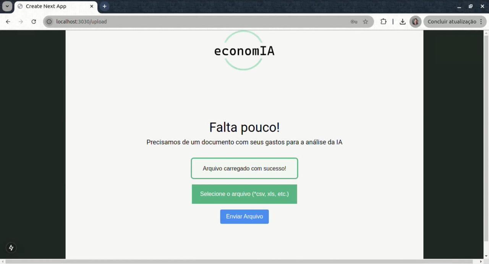
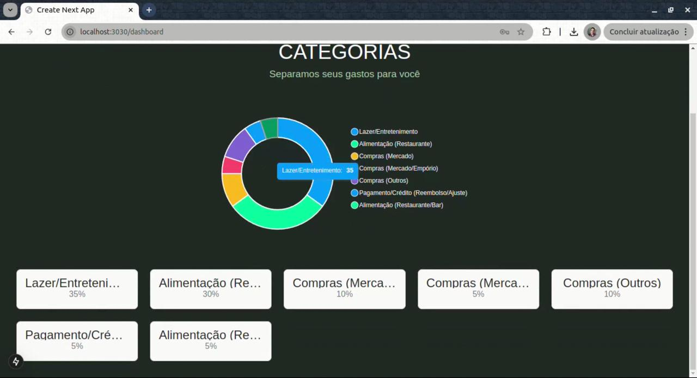

# economIA
**Planejador Financeiro Automático com Inteligência Artificial**

O **economIA** é um inovador planejador financeiro que utiliza Inteligência Artificial para facilitar o gerenciamento de suas finanças pessoais. Com apenas alguns passos, você pode importar suas planilhas no formato CSV e permitir que nossa IA categorize automaticamente seus gastos, ajudando você a visualizar e controlar melhor suas finanças.

---

## Recursos Principais
- **Cadastro e autenticação de usuários.**  
- **Importação e leitura automática de planilhas CSV.**  
- **Inteligência Artificial para categorização automática de despesas e receitas.**  
- **Dashboard intuitivo para acompanhamento financeiro.**  

---

## Pré-requisitos
Certifique-se de ter instalado em sua máquina:  
- Node.js e npm ou Yarn.  
- Google Cloud CLI.  
- MySQL.  

---

## Como Instalar e Configurar o MySQL

1. **Baixar o MySQL**  
   - Acesse o site oficial do MySQL: [MySQL Downloads](https://dev.mysql.com/downloads/).
   - Baixe a versão apropriada para o seu sistema operacional.

2. **Instalar o MySQL**  
   - Siga as instruções do instalador para completar a instalação.  
   - Durante a instalação, defina uma senha para o usuário `root`. Lembre-se desta senha, pois será necessária para configurar o projeto.

3. **Iniciar o Servidor MySQL**  
   - Após a instalação, inicie o serviço do MySQL. Em sistemas Windows, você pode usar o aplicativo "MySQL Workbench". Em sistemas Linux/macOS, utilize o seguinte comando no terminal:  
     ```bash
     sudo systemctl start mysql
     ```

4. **Criar o Banco de Dados**  
   - Acesse o console do MySQL:  
     ```bash
     mysql -u root -p
     ```
   - Insira a senha do usuário `root`.  
   - Execute os comandos abaixo para criar o banco de dados para o projeto:  
     ```sql
     CREATE DATABASE economIA;
     USE economIA;
     ```

5. **Configurar o Acesso**  
   - Certifique-se de que o usuário `root` ou outro usuário que você pretende usar tenha permissões adequadas para o banco de dados criado.

---

## Como Instalar e Executar Localmente

### 1. Clonar o repositório
Navegue até a pasta onde deseja salvar o projeto e execute:  
```bash
git clone https://github.com/Gui-Rigaud/economIA
```

### 2. Instalar as dependências
Entre nos diretórios do projeto e instale as dependências:  
**Frontend:**  
```bash
cd frontend
npm install
```  
**Backend:**  
```bash
cd ../backend
npm install
```  

### 3. Instalar e configurar o Google Cloud CLI
Siga as instruções para instalar o Google Cloud CLI: [Instalação do Google Cloud CLI](https://cloud.google.com/sdk/docs/install?hl=pt-br).  
Após instalar, é necessário realizar a autenticação utilizando o arquivo de autenticação enviado por e-mail
Baixe o arquivo, coloque-o dentro da pasta **backend** e execute o seguinte comando antes de iniciar o servidor backend:
- Caso esteja no Linux:
  ```bash
  $env:GOOGLE_APPLICATION_CREDENTIALS=nome_arquivo
  ```
- Caso esteja no Windows:
  ```bash
  set GOOGLE_APPLICATION_CREDENTIALS=nome_arquivo
  ```

### 4. Configurar variáveis de ambiente
Crie um arquivo `.env` no diretório do **backend** e adicione as seguintes variáveis:  
```plaintext
DATABASE_URL=mysql://root:<sua_senha>@localhost:3306/economIA
API_KEY=sua_chave_da_API
JWT_SECRET=uma_chave_secreta_para_o_JWT
```
Substitua `<sua_senha>` pela senha definida para o usuário `root` do MySQL.

### 5. Executar migrações do banco de dados
No diretório do **backend**, execute o comando:  
```bash
npx prisma migrate dev
```

### 6. Iniciar o servidor backend
Navegue para a pasta do backend e inicie o servidor:  
```bash
yarn dev
```

### 7. Iniciar o frontend
Em outra janela do terminal, vá para a pasta do frontend e execute:  
```bash
yarn dev
```

### 8. Acessar o economIA
Abra seu navegador e acesse o frontend do economIA no endereço [http://localhost:3000](http://localhost:3000).

---

## Imagens do funcionamento do economIA:

### Tela Inicial:



### Tela de Cadastro:



### Tela de Login:



### Tela de update de CSV:



### Tela de categorização feita pela IA:



---

## Licença
Este projeto está licenciado sob a [MIT License](LICENSE).  

---

## Equipe
- Guilherme Rigaud
- Hugo Nicéas
- João Guilherme Ohashi
- Luiz Eduardo de Andrade
- Marcos Didier  

---

## Agradecimentos
Agradecemos a todos os contribuidores e apoiadores que tornam o **economIA** possível! 🚀
